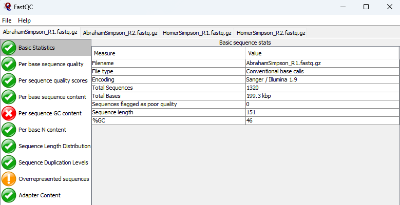

## Análisis de expresión diferencial de genes relacionados con la obesidad mediante RNA-seq (Actividad-2-Grupo-5)

La obesidad se asocia a inactividad física y a la dieta, pero en general es una condición multifactorial asociada a alteraciones metabólicas y a cambios en la regulación de múltiples genes. El análisis de expresión génica mediante RNA-seq permite estudiar estos cambios a nivel transcriptómico e identificar genes diferencialmente expresados entre distintos fenotipos. En este trabajo se analizaron perfiles de expresión simulados para evaluar diferencias asociadas a obesidad en personajes del universo de *Los Simpson*, aplicando herramientas bioinformáticas para su cuantificación, normalización e interpretación biológica.

Universo de análisis:

MargeSimpson,Sobrepeso/Obeso2,38,Femenino
BartSimpson,Normopeso,10,Masculino
LisaSimpson,Normopeso,8,Femenino
MaggieSimpson,Normopeso,1,Femenino
PattyBouvier,Sobrepeso/Obeso2,40,Femenino
SelmaBouvier,Sobrepeso/Obeso2,40,Femenino

|Sample  |Condition  |Age  |Sex  |
|--|--|--|--|
| **Abraham Simpson**| Sobrepeso/Obeso1| 80| Masculino|
| **Homer Simpson**| Sobrepeso/Obeso2| 40| Masculino|
| Marge Simpson| Sobrepeso/Obeso2| 38| Femenino|
| Bart Simpson| Normopeso| 10| Masculino|
| Lisa Simpson| Normopeso| 8| Femenino|
| Maggie Simpson| Normopeso| 1| Femenino|
| Patty Bouvier| Sobrepeso/Obeso2| 40| Femenino|
| Selma Bouvier| Sobrepeso/Obeso2| 40| Femenino|

Para el control de calidad usamos [FastQC](https://www.bioinformatics.babraham.ac.uk/projects/fastqc/), esta herramienta está hecha con el lenguaje de programación JAVA, la podemos descargar para nuestro sistema operativo, desde este [enlace](https://www.bioinformatics.babraham.ac.uk/projects/download.html#fastqc) y trabajar localmente en nuestras computadoras.
En este apartado usamos según nuestro grupo No. 5, Grupo Obeso1 (Familia 1, Sobrepeso/Obeso): Abraham Simpson y Homer Simpson encontramos los resultados que se muestran en las siguientes imágenes, así en cada pestaña aparecen los resultados:

El análisis de control de calidad mediante FastQC mostró lecturas de buena calidad, sin secuencias marcadas como baja calidad y con contenido GC dentro de los rangos esperados. No se consideró necesario realizar trimming.

## Secuenciación y Ómicas de Próxima Generación

### Grupo No. 5, Integrantes:
|Nombre  |
|--|
| Deivis Martínez|
| Carlos Pérez|
| Freddy Rodríguez|

